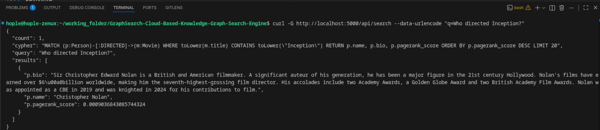

# GraphSearch — Cloud-Based Knowledge Graph Search Engine

A semantic search engine that converts natural language queries into Neo4j graph traversals, backed by PostgreSQL for caching and analytics.

**Example:** Ask `"Who directed Inception?"` → LangChain converts it to Cypher → runs against Neo4j → returns Christopher Nolan with bio and PageRank score.

---

## System Architecture

```
┌─────────────────────────────────────────────────────────────────────┐
│                          FRONTEND (React)                           │
│              Search bar → Results display → Analytics page          │
└──────────────────────────────┬──────────────────────────────────────┘
                               │ REST API
┌──────────────────────────────▼──────────────────────────────────────┐
│                      BACKEND (Python + Flask)                       │
│                                                                     │
│  ┌──────────────┐  ┌──────────────┐  ┌───────────────────────┐      │
│  │ /api/search  │  │  /api/auth   │  │  /api/analytics       │      │
│  │  LangChain   │  │  JWT auth    │  │  Top queries, avg     │      │
│  │  → Cypher    │  │  User CRUD   │  │  latency, graph stats │      │
│  │  → Neo4j     │  │              │  │                       │      │
│  └──────┬───────┘  └──────┬───────┘  └───────────┬───────────┘      │
└─────────┼─────────────────┼──────────────────────┼──────────────────┘
          │                 │                      │
    ┌─────▼─────┐     ┌─────▼──────────────────────▼───────┐
    │   Neo4j   │     │          PostgreSQL                 │
    │  AuraDB   │     │  users, query_logs, result_cache    │
    └───────────┘     │  PgBouncer (connection pooling)     │
                      └────────────────────────────────────┘
```

---

## Prerequisites

- [Docker Desktop](https://www.docker.com/products/docker-desktop/) installed and running
- [Neo4j AuraDB Free](https://neo4j.com/cloud/aura/) account — free cloud-hosted graph database
- [TMDB API](https://www.themoviedb.org/settings/api) account — free movie database API
- [OpenAI API](https://platform.openai.com/) key — used for NL → Cypher translation (gpt-4o-mini)

---

## Project Structure

```
GraphSearch/
├── docker-compose.yml          # PostgreSQL + PgBouncer + Flask
├── .env                        # your secrets (not committed)
├── .env.example                # template for .env
│
├── backend/
│   ├── Dockerfile
│   ├── requirements.txt
│   ├── run.py                  # Flask entry point
│   ├── app/
│   │   ├── __init__.py         # app factory, registers blueprints
│   │   ├── config.py           # reads env vars
│   │   ├── routes/
│   │   │   └── search.py       # GET /api/search
│   │   └── services/
│   │       └── graph_service.py  # NL → Cypher → Neo4j pipeline
│   └── tests/
│       └── test_search.py      # pytest suite
│
└── data/
    ├── ingest_tmdb.py          # pulls TMDB data into Neo4j
    └── compute_pagerank.py     # computes PageRank scores via NetworkX
```

---

## Setup

### 1. Clone and configure environment

```bash
git clone <repo-url>
cd GraphSearch-Cloud-Based-Knowledge-Graph-Search-Engine

cp .env.example .env
```

Open `.env` and fill in your credentials:

```env
SECRET_KEY=any-random-string

POSTGRES_DB=graphsearch
POSTGRES_USER=graphsearch
POSTGRES_PASSWORD=choose-a-password

# From Neo4j AuraDB console after creating a free instance
NEO4J_URI=neo4j+s://xxxxxxxx.databases.neo4j.io
NEO4J_USER=neo4j
NEO4J_PASSWORD=your-aura-password

# From TMDB → Settings → API → API Read Access Token (Bearer token, starts with ey...)
TMDB_API_TOKEN=your-tmdb-token

# From OpenAI platform
OPENAI_API_KEY=sk-...
```

---

### 2. Start the containers

```bash
docker compose up --build -d
```

This starts three services:
- `db` — PostgreSQL on port 5433
- `pgbouncer` — connection pooler on port 6432
- `backend` — Flask API on port 5000

Verify they're running:

```bash
docker compose ps
```

Verify the API is up:

```bash
curl http://localhost:5000/health
# → {"status": "ok"}
```

---

### 3. Ingest movie data into Neo4j

This pulls 500 popular movies + cast + directors from TMDB and stores them as a graph in Neo4j AuraDB. Takes ~5-10 minutes.

```bash
docker compose exec backend python /data/ingest_tmdb.py
```

Expected output at the end:
```
Node counts:
  Person: 4276
  Movie: 536
  Genre: 19
  Company: 690
```

---

### 4. Compute PageRank scores

This runs weighted PageRank via NetworkX on the Person-Person and Movie-Movie graphs, then writes scores back to Neo4j.

```bash
docker compose exec backend python /data/compute_pagerank.py
```

Expected output:
```
Top 5 persons by PageRank:
  Leonardo DiCaprio: 0.00312
  Ralph Fiennes: 0.00298
  ...
Top 5 movies by PageRank:
  Avengers: Endgame: 0.00445
  ...
```

---

## Using the Search API

```bash
curl -G "http://localhost:5000/api/search" \
  --data-urlencode "q=Who directed Inception?"
```


Response:

```json
{
  "query": "Who directed Inception?",
  "cypher": "MATCH (p:Person)-[:DIRECTED]->(m:Movie) WHERE toLower(m.title) CONTAINS toLower(\"Inception\") RETURN p.name, p.bio, p.pagerank_score ORDER BY p.pagerank_score DESC LIMIT 20",
  "results": [
    {
      "p.name": "Christopher Nolan",
      "p.bio": "Sir Christopher Edward Nolan is a British and American filmmaker...",
      "p.pagerank_score": 0.0009036843085744324
    }
  ],
  "count": 1
}
```


More example queries:
```bash
curl -G "http://localhost:5000/api/search" --data-urlencode "q=Movies starring Leonardo DiCaprio"
curl -G "http://localhost:5000/api/search" --data-urlencode "q=Top action movies"
curl -G "http://localhost:5000/api/search" --data-urlencode "q=Who produced Interstellar?"
```

---

## Running Tests

```bash
docker compose exec backend pytest tests/ -v
```

Expected output:
```
tests/test_search.py::test_empty_query_returns_400         PASSED
tests/test_search.py::test_blank_query_returns_400         PASSED
tests/test_search.py::test_valid_query_returns_results     PASSED
tests/test_search.py::test_search_service_error_returns_500 PASSED

4 passed in 0.54s
```

---

## Stopping the project

```bash
# Stop containers (data is preserved)
docker compose down

# Stop and delete all data (PostgreSQL volume wiped)
docker compose down -v
```

If you wipe with `-v`, you need to re-run steps 3 and 4 to repopulate Neo4j.
